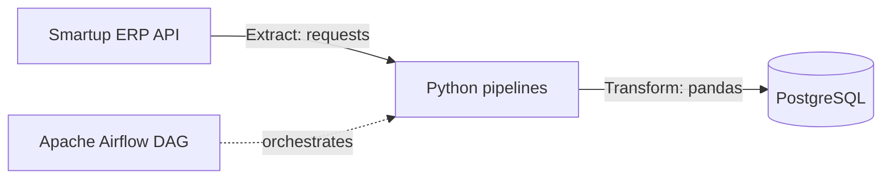
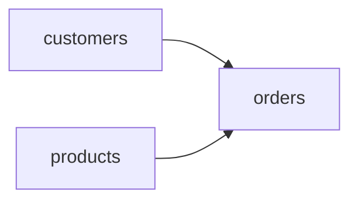

# Smartup ETL Pipeline with Apache Airflow

An automated ETL pipeline that extracts business data from the **Smartup ERP** REST API, transforms it with **Pandas**, and loads it into **PostgreSQL**. The workflow is orchestrated with **Apache Airflow** running in **Docker**.

---

## 🧭 Architecture



**DAG task order** — customers and products load in parallel, then orders:



---

## 📦 Data Sources

| Entity | Smartup endpoint |
|---|---|
| Products / inventory | `inventory$export` |
| Legal-person customers | `legal_person$export` |
| Natural-person customers | `natural_person$export` |
| Orders | `order$export` |

---

## 🛠 Tech Stack

- **Python** — `requests`, `pandas`, `SQLAlchemy`, `psycopg2`
- **Apache Airflow** — DAG with `BashOperator` tasks, retries and dependencies
- **PostgreSQL** — target data warehouse
- **Docker Compose** — runs Airflow locally

---

## 📁 Project Structure

```
├── dags/
│   ├── dag.py                    # Airflow DAG: task order, retries, schedule
│   └── pipelines/
│       ├── config.py             # API endpoints, auth headers, DB connection
│       ├── client.py             # API requests + JSON → DataFrame
│       ├── customers.py          # Customers pipeline
│       ├── products.py           # Products pipeline
│       ├── orders.py             # Orders pipeline
│       ├── load.py               # Loading DataFrames into PostgreSQL
│       └── auth.example.json     # Template for credentials
├── docker-compose.yaml
└── .gitignore
```

---

## ⚙️ Key Features

- **Error handling** — failed API calls return an empty DataFrame instead of crashing the run
- **Automatic retries** — each task retries 2 times with a 1-minute delay
- **Parallel execution** — independent tasks (customers, products) run at the same time
- **Secure credentials** — secrets live in a local `auth.json` that is excluded from Git

---

## 🚀 How to Run

1. Clone the repository
   ```bash
   git clone https://github.com/Azizbek0828/SmartUp-ETL-airflow.git
   cd SmartUp-ETL-airflow
   ```
2. Create your credentials file from the template
   ```bash
   cp dags/pipelines/auth.example.json dags/pipelines/auth.json
   ```
   Then fill in your Smartup API and PostgreSQL credentials.
3. Start Airflow
   ```bash
   docker compose up -d
   ```
4. Open the Airflow UI at `http://localhost:8080` and trigger the **`smartup_etl`** DAG.

---

## 👤 Author

**Azizbek Gulmonov** — Junior Data Analyst
GitHub: [@Azizbek0828](https://github.com/Azizbek0828) · Telegram: [@ago_101](https://t.me/ago_101)